# Library Management System

## Table of Contents
1. [Introduction](#1-introduction)
2. [Problem Statement](#2-problem-statement)
3. [Database Schema](#3-database-schema)
4. [Implementation Details](#4-implementation-details)
5. [Query Examples](#5-query-examples)
6. [Testing and Results](#6-testing-and-results)
7. [Setup and Installation](#7-setup-and-installation)
8. [Conclusion](#8-conclusion)

## 1. Introduction

**Project Information**
- **Name**: Pacifique Bakundukize
- **Student ID**: 26798
- **Specialization**: Software Engineering
- **Database**: Oracle PDB (PDB26798)

This document provides comprehensive documentation for a Library Management System implemented using Oracle Database. The system demonstrates advanced database concepts including:

- Relational database design
- Complex SQL queries
- Transaction management
- Access control
- Data integrity constraints

## 2. Problem Statement

### 2.1 Overview
Modern libraries require robust systems to manage their resources efficiently. This system addresses the following core requirements:

### 2.2 Key Requirements
- Book inventory management across multiple categories
- Author management with support for multiple authors per book
- Member profile management
- Loan transaction tracking
- Data integrity and consistency maintenance

### 2.3 Business Rules
- Books can belong to multiple categories
- Books can have multiple authors
- Members can borrow multiple books
- Each loan must track both issue and return dates

## 3. Database Schema

Below is a summary of the **entities** (tables) and their relationships:

1. **Categories**

   - **Purpose**: Classify books (e.g., Technology, Biography, etc.).
   - **Primary Key**: `category_id` (generated by identity).
   - **Attributes**: `category_name`.
2. **Books**

   - **Purpose**: Stores each book’s details.
   - **Primary Key**: `book_id` (generated by identity).
   - **Attributes**: `title`, `publication_year`, `price`, `rating`, `category_id` (FK → `Categories`).
   - **Relationship**: Many books can belong to one category (one-to-many).
3. **Authors**

   - **Purpose**: Stores information about authors.
   - **Primary Key**: `author_id` (generated by identity).
   - **Attributes**: `name`, `bio`.
4. **BookAuthors**

   - **Purpose**: Resolves the many-to-many relationship between Books and Authors.
   - **Primary Key**: Composite (`book_id`, `author_id`).
   - **Foreign Keys**: `book_id` → `Books(book_id)`, `author_id` → `Authors(author_id)`.
5. **Members**

   - **Purpose**: Stores basic member information.
   - **Primary Key**: `member_id` (generated by identity).
   - **Attributes**: `name`, `email`, `membership_date`.
6. **MemberProfiles**

   - **Purpose**: Extended profile info for each member.
   - **Primary Key**: `member_id` (same as in `Members`).
   - **Attributes**: `address`, `phone`.
   - **Relationship**: One-to-one (each member has exactly one profile).
7. **Loans**

   - **Purpose**: Transaction table that records each borrowing event.
   - **Primary Key**: `loan_id` (generated by identity).
   - **Attributes**: `book_id` (FK), `member_id` (FK), `loan_date`, `return_date`, `created_at`.
   - **Relationship**: A single book can appear in many loan records, and a member can have many loans (two many-to-one relationships).

### Conceptual Diagram

Here is the conceptual diagram illustrating the tables, their attributes, and relationships:

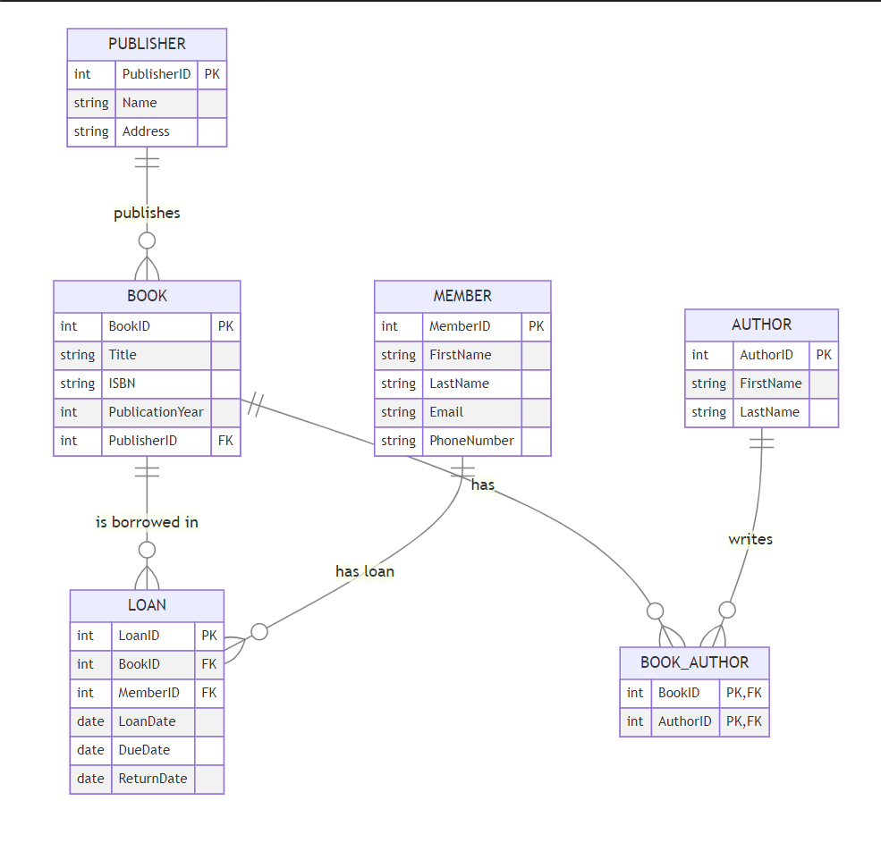

> *Screenshot 1: Conceptual ER diagram showing tables, primary keys, foreign keys, and relationships.*

## 4. Implementation Details

All SQL commands are organized into **DDL**, **DCL**, **DML**, **TCL**, and **Queries**. They can be run in a single script or split across multiple files (e.g., `schema.sql`, `data.sql`, `queries.sql`, etc.).

### 4.1 DDL (Data Definition Language)

1. **Altering Session**

   ```sql
   ALTER SESSION SET CONTAINER = PDB26798;
   ```

   - Switches to the pluggable database (`PDB26798`) to ensure all subsequent operations occur in the correct container.
2. **Creating Tables**

   ```sql
   CREATE TABLE Categories (
       category_id   NUMBER GENERATED BY DEFAULT AS IDENTITY PRIMARY KEY,
       category_name VARCHAR2(100) NOT NULL
   );
   ```

   Similar statements for **Books**, **Authors**, **BookAuthors**, **Members**, **MemberProfiles**, and **Loans**. Each table definition includes constraints like **PRIMARY KEY** and **FOREIGN KEY** references.
3. **Foreign Key Constraints**

   - Example:
     ```sql
     CONSTRAINT fk_books_category
         FOREIGN KEY (category_id) REFERENCES Categories(category_id)
     ```
   - Ensures data integrity between **Books** and **Categories**.

### 4.2 DCL (Data Control Language)

1. **User Creation**

   ```sql
   CREATE USER bpacifique26798 IDENTIFIED BY "Euqificap12."
   QUOTA UNLIMITED ON USERS;
   ```

   Creates a new database user with a specified password and assigns an unlimited quota on the USERS tablespace.
2. **Granting Privileges**

   ```sql
   GRANT CREATE SESSION TO bpacifique26798;
   GRANT CREATE TABLE TO bpacifique26798;
   ```

   - Allows the new user to log in (`CREATE SESSION`) and create tables (`CREATE TABLE`).
3. **Object Privileges**

   ```sql
   GRANT SELECT, INSERT, UPDATE, DELETE ON Categories TO bpacifique26798;
   ```

   - Grants necessary DML permissions on each table to the new user.

### 4.3 DML (Data Manipulation Language)

1. **Inserting Data**

   - **Categories**:
     ```sql
     INSERT INTO Categories (category_name) VALUES ('Technology');
     INSERT INTO Categories (category_name) VALUES ('Biography');
     ...
     COMMIT;
     ```
   - **Books**:
     ```sql
     INSERT INTO Books (title, publication_year, category_id, price, rating)
     VALUES ('The Oracle of Delphi', 2018, 1, 29.99, 4.5);
     ...
     COMMIT;
     ```
   - **Authors**, **BookAuthors**, **Members**, **MemberProfiles**, **Loans** similarly.
2. **Updating Data**

   ```sql
   UPDATE Books
   SET title = 'The Oracle at Delphi'
   WHERE book_id = 1;
   COMMIT;
   ```

   - Example of correcting a book title.
3. **Deleting Data**

   ```sql
   DELETE FROM BookAuthors WHERE author_id = 2;
   DELETE FROM Authors WHERE author_id = 2;
   COMMIT;
   ```

   - Demonstrates removing an author and their associated records in the join table.

### 4.4 TCL (Transaction Control Language)

Transaction Control Language statements manage how changes are committed or rolled back:

1. **SAVEPOINT**

   ```sql
   SAVEPOINT before_loan;
   ```

   - Marks a transaction point to which you can roll back.
2. **ROLLBACK**

   ```sql
   ROLLBACK TO before_loan;
   ```

   - Reverts all changes back to the state at `before_loan`.
3. **COMMIT**

   - Finalizes all changes in the current transaction.

Example:

```sql
SAVEPOINT before_loan;
INSERT INTO Loans (book_id, member_id, loan_date, return_date, created_at)
VALUES (3, 2, SYSDATE, NULL, SYSDATE);

-- If something goes wrong:
-- ROLLBACK TO before_loan;

COMMIT;
```

## 5. Query Examples

### 5.1 Basic Queries
```sql
-- Get all books with their categories
SELECT b.book_id,
       b.title,
       c.category_name,
       b.price,
       b.rating
FROM Books b
LEFT JOIN Categories c ON b.category_id = c.category_id;
```

**Purpose**: Retrieves complete book information with categories
**Use Case**: Book inventory management and reporting

### 5.2 Advanced Analytics
```sql
-- Find popular books (borrowed > 3 times)
SELECT 
    b.title,
    c.category_name,
    COUNT(*) AS loan_count
FROM Books b
JOIN Loans l ON b.book_id = l.book_id
JOIN Categories c ON b.category_id = c.category_id
GROUP BY b.book_id, b.title, c.category_name
HAVING COUNT(*) > 3;
```

**Purpose**: Identifies frequently borrowed books
**Business Impact**: Helps in inventory planning and book procurement

## 6. Testing and Results

1. **Conceptual Diagram**

   - Shown above . As well the codes for it are in ('/library.mmd')
2. **Open PDB Container**-Show above 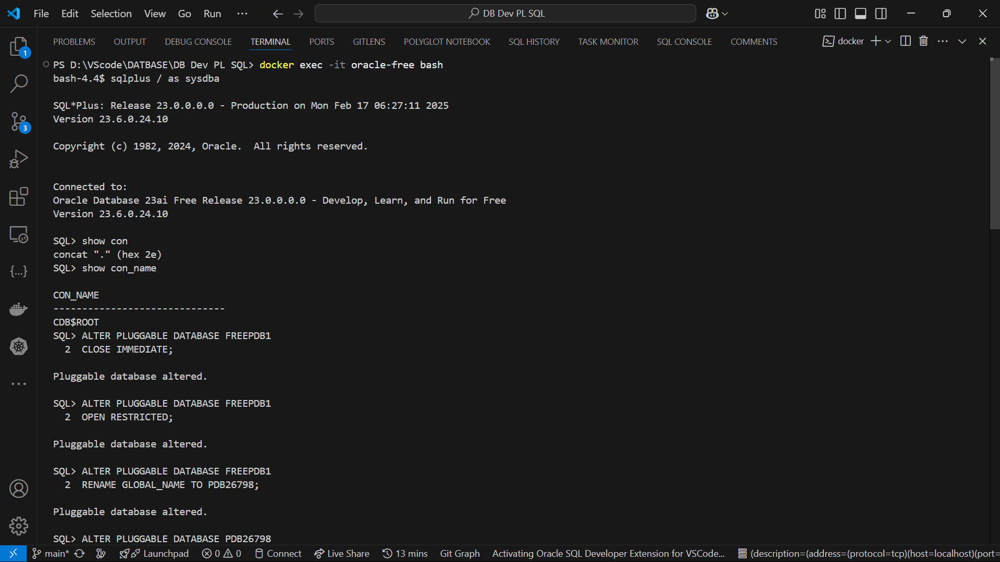
   It's listed in the file name [sql_test_script.sql]
3. **Query Results**
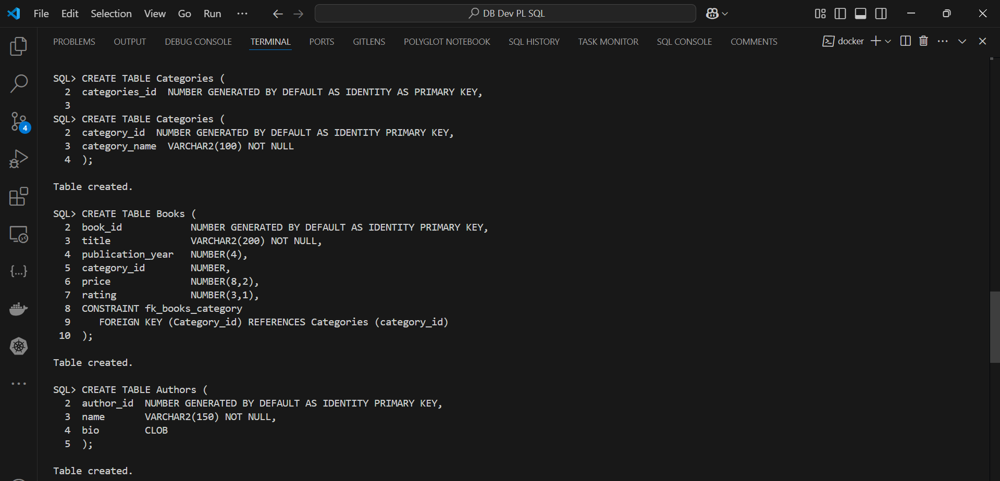

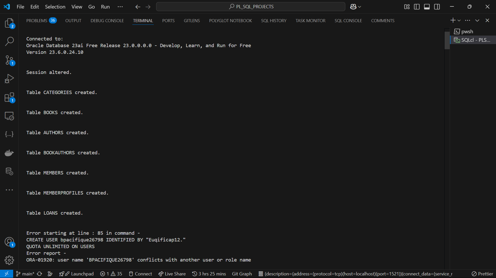
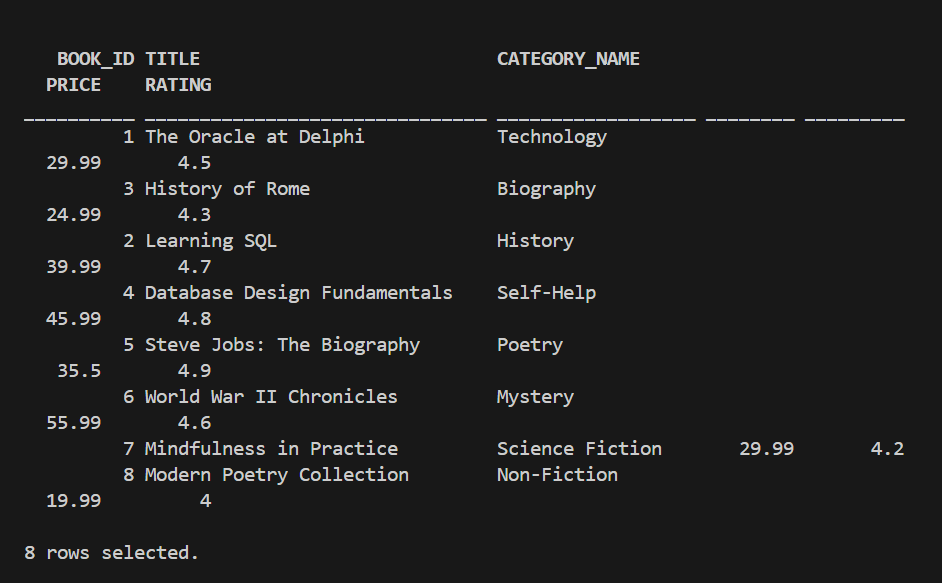
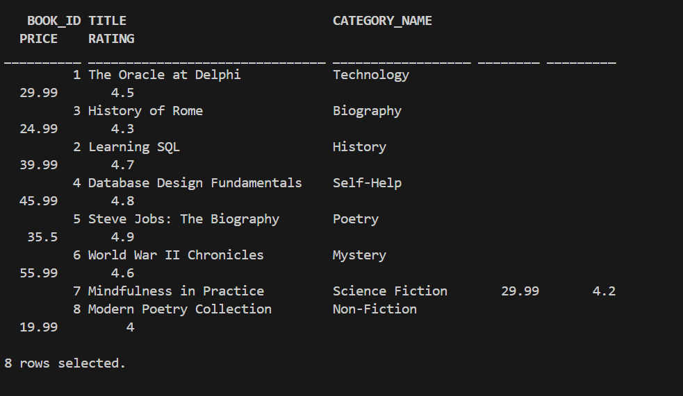
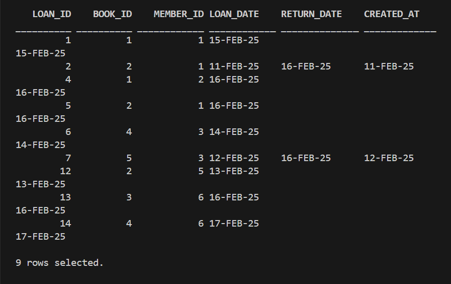
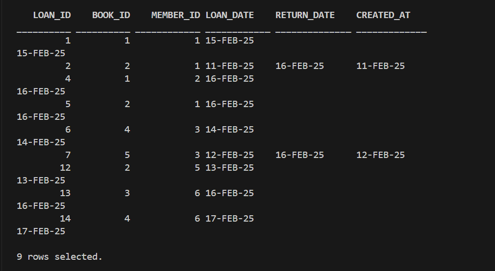
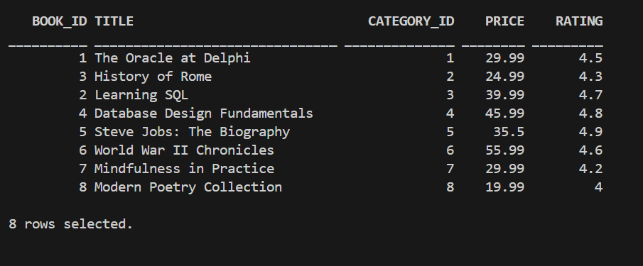
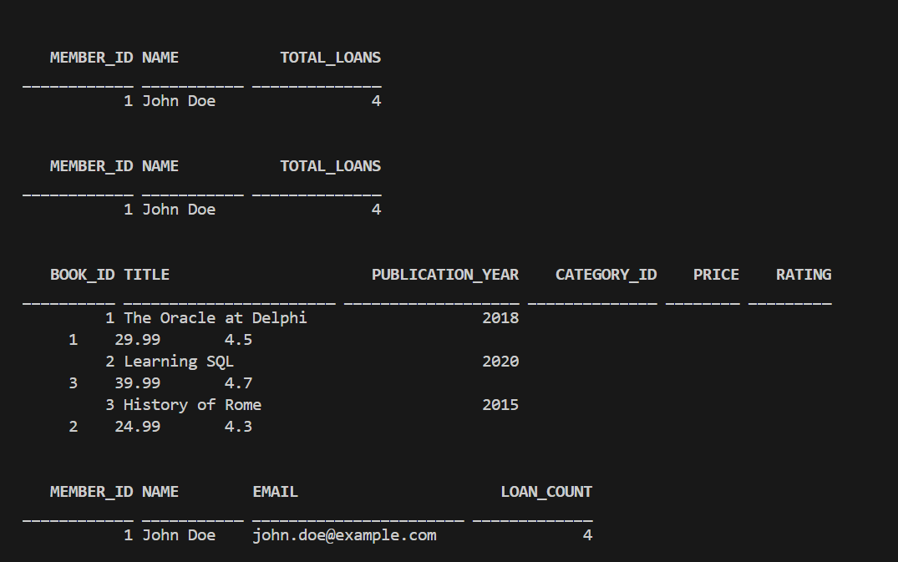
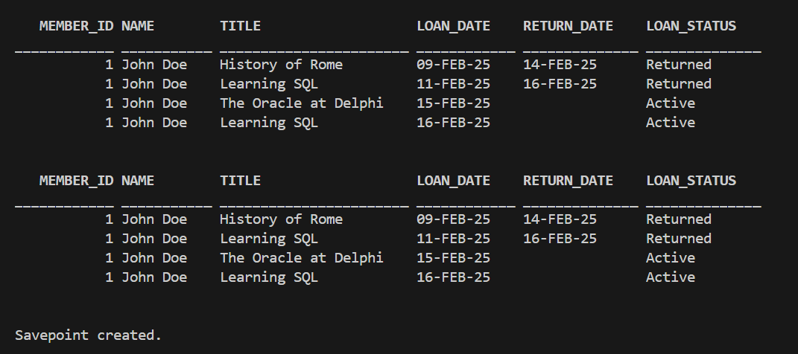

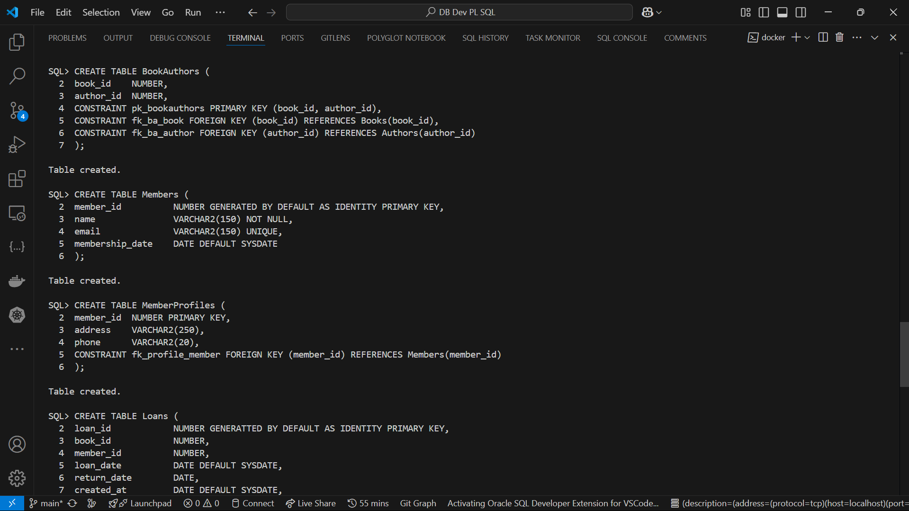
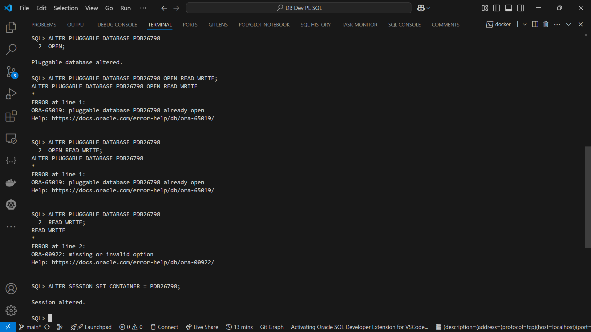
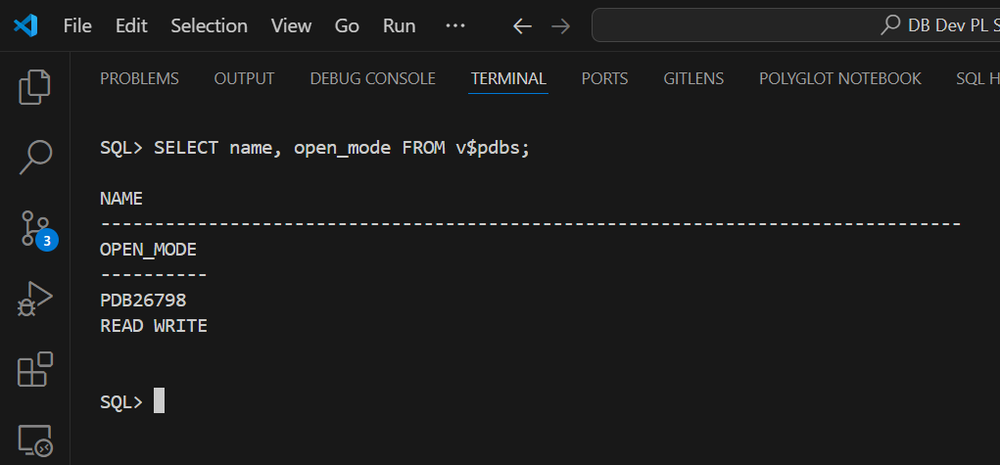
# All query results were put in a file name (sql_test_script.sql)#

  The file contains all the project work from the beginning till completion of everything, plus it being systematic.

## 7. Setup and Installation

### Prerequisites
- Oracle Database 19c or higher
- SQL*Plus or Oracle SQL Developer
- Minimum 500MB storage space

### Installation Steps
1. **Database Setup**
   ```sql
   -- Connect as SYSDBA
   ALTER SESSION SET CONTAINER = PDB26798;
   ALTER PLUGGABLE DATABASE PDB26798 OPEN READ WRITE;
   ```

2. **Schema Creation**
   ```sql
   -- Create application user
   CREATE USER bpacifique26798 IDENTIFIED BY "Euqificap12."
   QUOTA UNLIMITED ON USERS;
   ```

## 8. Conclusion

### Key Achievements
- Implemented a fully normalized database design
- Developed comprehensive transaction management
- Created efficient queries for common library operations

### Future Enhancements
- Add support for digital content management
- Implement fine calculation system
- Add reporting dashboard

---

## Appendix

### A. Database Diagrams

*Figure 1: Entity-Relationship Diagram*

### B. Test Results


*Figure 2: Sample Query Execution Results*

---

**Repository:** [GitHub Link]

